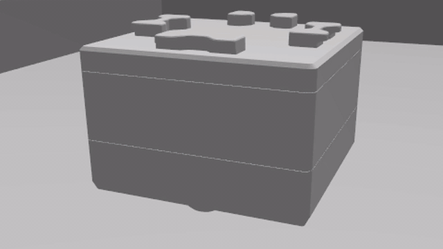

# Topics and launch arguments

These match the interface of the real cube provided by
[toio_ros2](https://github.com/atinfinity/toio_ros2), so the same commands work
against the simulation and against the hardware. For the full list of toio_ros2
interfaces and which ones the simulation supports, stubs or leaves out, see
[toio_ros2 interface support](toio_ros2_support.md).

## Subscribed topics

| topic | type | description |
| --- | --- | --- |
| `/cmd_vel` | [geometry_msgs/msg/Twist](https://docs.ros2.org/latest/api/geometry_msgs/msg/Twist.html) | Desired velocity of the cube |
| `/toio/led` | [std_msgs/msg/ColorRGBA](https://docs.ros2.org/latest/api/std_msgs/msg/ColorRGBA.html) | Color of the indicator LED. `r`, `g` and `b` are taken as 0.0-1.0 and are clipped into that range, `a` is unused. An all zero color turns the LED off |
| `/toio/sound` | [std_msgs/msg/UInt8](https://docs.ros2.org/latest/api/std_msgs/msg/UInt8.html) | Sound effect id, 0-10. Ids outside that range are logged as a warning and ignored |
| `/toio/led_timed` | [toio_msgs/msg/Led](https://github.com/atinfinity/toio_msgs) | Indicator color with the lighting time in the message, for when `led_duration_ms` is not the same for every command |
| `/toio/led_pattern` | [toio_msgs/msg/LedPattern](https://github.com/atinfinity/toio_msgs) | Blink sequence, up to 29 steps. `repeat` 0 repeats until the next indicator command |
| `/toio/melody` | [toio_msgs/msg/Melody](https://github.com/atinfinity/toio_msgs) | MIDI melody, up to 59 notes. Shares the sound throttle with `/toio/sound` |

## Published topics

| topic | type | description |
| --- | --- | --- |
| `/joint_states` | [sensor_msgs/msg/JointState](https://docs.ros2.org/latest/api/sensor_msgs/msg/JointState.html) | State of the wheel joints |
| `/tf` | [tf2_msgs/msg/TFMessage](https://docs.ros2.org/latest/api/tf2_msgs/msg/TFMessage.html) | Pose of the cube. With `publish_odom` (default) the tree is `map -> odom -> center`; `map -> odom` is identity and `odom -> center` is the mat-perfect ground-truth pose, so `map -> center` is exact. With `publish_odom:=False` it is `map -> center` directly |
| `/odom` | [nav_msgs/msg/Odometry](https://docs.ros2.org/latest/api/nav_msgs/msg/Odometry.html) | Wheel odometry at 20Hz (`odom -> center`), only when `publish_odom` is true. Mirrors the `/odom` of [toio_ros2](https://github.com/atinfinity/toio_ros2). Note: the pose in this message is the wheel integration (it drifts), while the `map -> odom -> center` TF is held at the ground-truth pose — so `/odom` and the TF can differ, a simulation simplification |
| `/toio/imu` | [sensor_msgs/msg/Imu](https://docs.ros2.org/latest/api/sensor_msgs/msg/Imu.html) | Orientation of the cube in the `center` frame every `imu_interval_ms`. Unlike the real cube (orientation only), the Gazebo values for angular velocity and linear acceleration are passed through as-is |
| `/toio/motion` | [toio_msgs/msg/MotionDetection](https://github.com/atinfinity/toio_msgs) | **Stub.** Gazebo has no motion-detection equivalent, so this is a fixed value for interface parity: `horizontal` true, `posture` `POSTURE_TOP`, and `collision` / `double_tap` / `shake` always false/none. `collision_threshold` / `horizontal_threshold` are accepted but ignored |

## Launch arguments

> The cube plays a pattern or a melody in its own firmware, so on hardware the
> timing does not depend on the host and a BLE dropout does not interrupt it.
> Nothing in Gazebo can sequence one on its own, so `toio_led_node` keeps the
> time on the ROS side instead: a busy or paused simulation stretches a
> pattern. For the same reason `repeat` 0 loops the LED pattern (a timer can be
> cancelled by the next command) but plays a melody once (a clip already handed
> to the player cannot be stopped).

| argument | default | description |
| --- | --- | --- |
| `led_duration_ms` | `0` | Lighting time of `/toio/led`. `0` keeps the indicator lit until the next command, `10`-`2550` turns it off once the time has elapsed |
| `led_light_intensity` | `1.0` | Intensity of the light of the lamp while it is lit. `0` leaves the lamp lighting up only itself, without casting color on the mat around the cube |
| `sound_volume` | `255` | Volume of `/toio/sound`. Per the toio specification this is mute or full volume only: `0` is mute and every other value is the maximum volume |
| `imu_interval_ms` | `100` | Notification interval of the posture angle behind `/toio/imu`, in milliseconds. The IMU sensor update rate is `1000/imu_interval_ms` Hz (default 10Hz) |
| `publish_odom` | `True` | Publish `/odom` and the `map -> odom -> center` TF tree. `False` restores the plain `map -> center` transform |

On the real cube these are parameters of the toio_ros2 node. Here they are
launch arguments, because the LED is driven by a Gazebo plugin and the sound is
played by a separate node.

## Examples

```bash
# Light the indicator in red, then turn it off
ros2 topic pub --once /toio/led std_msgs/msg/ColorRGBA '{r: 1.0, g: 0.0, b: 0.0, a: 1.0}'
ros2 topic pub --once /toio/led std_msgs/msg/ColorRGBA '{r: 0.0, g: 0.0, b: 0.0, a: 1.0}'
```

Light red for 1.5 seconds, blink blue three times, and play three notes:

```bash
ros2 topic pub --once /toio/led_timed toio_msgs/msg/Led '{color: {r: 1.0, g: 0.0, b: 0.0, a: 1.0}, duration_ms: 1500}'
ros2 topic pub --once /toio/led_pattern toio_msgs/msg/LedPattern '{steps: [{color: {r: 0.0, g: 0.0, b: 1.0, a: 1.0}, duration_ms: 400}, {color: {r: 0.0, g: 0.0, b: 0.0, a: 1.0}, duration_ms: 400}], repeat: 3}'
ros2 topic pub --once /toio/melody toio_msgs/msg/Melody '{notes: [{duration_ms: 400, note: 60, volume: 255}, {duration_ms: 400, note: 64, volume: 255}, {duration_ms: 400, note: 67, volume: 255}], repeat: 1}'

# Play a sound effect
ros2 topic pub --once /toio/sound std_msgs/msg/UInt8 '{data: 6}'

# Let the cube turn the indicator off after 500 ms
ros2 launch toio_gazebo simulation.launch.py led_duration_ms:=500
```



See [Notes on the LED and the sound effects](led_and_sound.md) for how the indicator and the sound are simulated.
